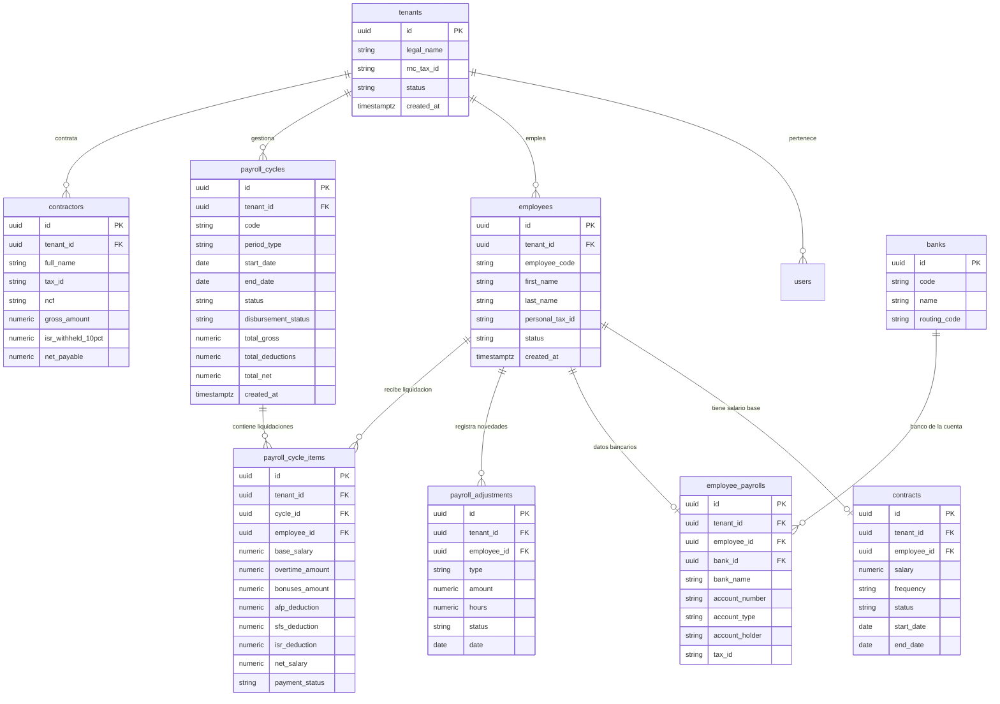

# Database Architecture & Data Model: [System / Project Name]

> 🗄️ Master Database Architecture Document · Living Data Blueprint
> 🔄 Last Updated: [YYYY-MM-DD] · Status: [Active / Production]
> 👤 Data Authority: [Lead DBA / Backend Architect]
> 🐘 Engine: PostgreSQL 16 (AWS RDS) · Multi-Tenant: [Logical / Row-Level Partitioning]

---

## 1. Engine Specifications & Connection Architecture

### 1.1 Server & Instance Configuration
- **Engine & Version**: PostgreSQL 16.x (AWS RDS Multi-AZ Deployment)
- **Primary Encoding**: `UTF-8` · Collation: `en_US.UTF-8`
- **Timezone**: `UTC` (Todas las fechas y marcas de tiempo se almacenan estrictamente en UTC)
- **Active Extensions**:
  - `uuid-ossp` / `pgcrypto`: Generación de claves primarias UUIDv4 nativas (`gen_random_uuid()`).
  - `unaccent`: Búsquedas fonéticas y normalización de texto sin tildes en nombres de colaboradores.
  - `pg_trgm`: Búsquedas difusas de texto (fuzzy search) y autocompletado en selectores de empleados.

### 1.2 Connection Pooling & Client Strategy
- **Conexión**: Administrada mediante Pool de conexiones seguro en `src/infrastructure/database/aws.ts`.
- **Límites del Pool**:
  - `max_connections`: [e.g. 20 conexiones simultáneas por instancia de aplicación]
  - `idleTimeoutMillis`: 30,000 ms
  - `connectionTimeoutMillis`: 5,000 ms
- **SSL**: Conexión obligatoria con SSL habilitado (`ssl: { rejectUnauthorized: true }`).

### 1.3 Database Schemas
- **`huro`**: Esquema principal de negocio (empleados, contratos, nómina, novedades, bancos).
- **`audit`**: Esquema inmutable de eventos de auditoría y traza de cambios.
- **`public`**: Restringido para extensiones y funciones del sistema.

---

## 2. Master Entity-Relationship Diagram (Global Domain ERD)



---

## 3. Multi-Tenancy Architecture & Partitioning

### 3.1 Logical Multi-Tenancy Pattern
- **Columna `tenant_id`**: Presente como clave foránea obligatoria (`NOT NULL`) en **todas** las tablas de negocio.
- **Claves Únicas Compuestas**: Cualquier unicidad de negocio (ej. código de colaborador, código de ciclo de nómina) debe incluir obligatoriamente el tenant:
  ```sql
  ALTER TABLE huro.payroll_cycles 
  ADD CONSTRAINT uq_payroll_cycle_code_tenant UNIQUE (tenant_id, code);
  ```

### 3.2 Row-Level Security (RLS) Policy
Como salvaguarda contra errores en consultas de backend, se implementa RLS en el motor:
```sql
ALTER TABLE huro.payroll_cycles ENABLE ROW LEVEL SECURITY;

CREATE POLICY tenant_isolation_policy ON huro.payroll_cycles
    FOR ALL
    USING (tenant_id = NULLIF(current_setting('app.current_tenant_id', true), '')::uuid);
```

---

## 4. Tipado de Datos, Precisión y Convenciones

| Dominio | Tipo de Dato PostgreSQL | Regla Técnica & Justificación |
|---------|-------------------------|-------------------------------|
| **Identificadores (PK)** | `UUID` (`DEFAULT gen_random_uuid()`) | Evita colisiones de enteros predecibles en APIs, facilita importaciones/fusiones y previene enumeración maliciosa. |
| **Monedas y Salarios** | `NUMERIC(12,2)` | **ESTRICTAMENTE PROHIBIDO `FLOAT` O `DOUBLE`**. Garantiza precisión exacta a dos decimales sin errores de redondeo de punto flotante. |
| **Tasas y Porcentajes** | `NUMERIC(6,4)` | Permite tasas exactas como AFP `0.0287` (2.87%) y SFS `0.0304` (3.04%). |
| **Marcas de Tiempo** | `TIMESTAMPTZ` | Timestamp con zona horaria almacenado en UTC. Siempre incluye `created_at` y `updated_at`. |
| **Fechas de Calendario** | `DATE` | Fechas puras de período contable sin componente de hora (ej. `start_date`, `end_date`). |
| **Estados del Ciclo** | `VARCHAR(50)` con `CHECK` | Convención de nombres en mayúsculas o minúsculas controladas por constraint (ej. `CHECK (status IN ('draft', 'in_review', 'calculated', 'approved', 'closed'))`). |
| **Borrados Lógicos** | `deleted_at TIMESTAMPTZ NULL` | Soft delete aplicado en entidades maestras para trazabilidad y auditoría legal. |

---

## 5. Convenciones de Indexación & Optimización de Consultas

### 5.1 Reglas Obligatorias de Índices
1. **Todas las claves foráneas (FK)** deben tener un índice B-tree para evitar Sequential Scans en operaciones de `JOIN` o `CASCADE`.
2. **Índices compuestos por Tenant**: Las consultas operan filtrando por tenant y ordenando por fecha:
   ```sql
   CREATE INDEX idx_payroll_cycles_tenant_created 
   ON huro.payroll_cycles (tenant_id, created_at DESC);
   ```
3. **Índices parciales para Soft Delete**: Excluyen registros eliminados para mantener el índice ligero y ultrarrápido:
   ```sql
   CREATE INDEX idx_active_employees 
   ON huro.employees (tenant_id, status) 
   WHERE deleted_at IS NULL;
   ```
4. **Índices de Búsqueda Trigrama (GIN)** para campos de texto dinámico:
   ```sql
   CREATE INDEX idx_employee_name_trgm 
   ON huro.employees USING gin ((first_name || ' ' || last_name) gin_trgm_ops);
   ```

---

## 6. Estrategia de Migraciones Zero-Downtime (Expand & Contract)

Toda modificación de base de datos en producción sigue el patrón **Expand-and-Contract**:


### Reglas Innegociables en Migraciones
1. **Prohibido renombrar o eliminar columnas en el mismo despliegue** que introduce el código que deja de usarlas.
2. **Agregar columnas con valor por defecto** debe realizarse sin bloqueo de tabla (aprovechar optimización de metadata de PostgreSQL 11+).
3. **Creación de índices concurrentes**: En tablas con más de 100,000 registros, siempre usar `CREATE INDEX CONCURRENTLY` para evitar lockeos de escritura.

---

## 7. Alta Disponibilidad, Backups & Disaster Recovery

- **Arquitectura Multi-AZ**: Réplica sincrónica en zona de disponibilidad secundaria de AWS con failover automático transparente (< 60 segundos).
- **Point-in-Time Recovery (PITR)**: Registros WAL continuos en S3 que permiten restaurar la base de datos a cualquier segundo de los últimos 35 días.
- **Métricas de Resiliencia (RPO / RTO)**:
  - **RPO (Recovery Point Objective)**: < 5 minutos de pérdida máxima potencial de datos.
  - **RTO (Recovery Time Objective)**: < 30 minutos para recuperación completa de servicio ante catástrofe de infraestructura.
- **Snapshots Automatizados**: Respaldo snapshot diario automático a las 03:00 AM UTC retenido durante 30 días.
