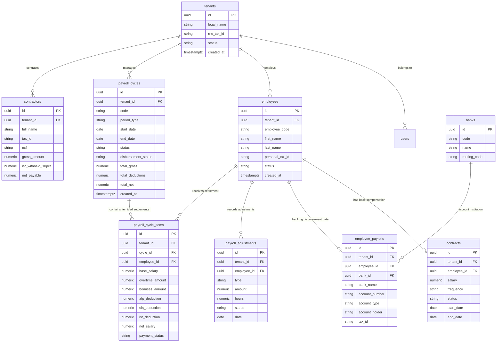
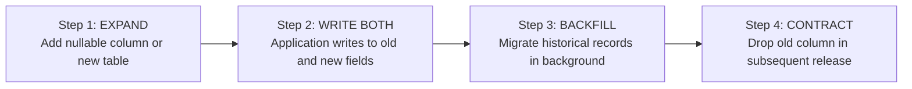

# Database Architecture & Data Model: [System / Project Name]

> 🗄️ Master Database Architecture Document · Living Data Blueprint
> 🔄 Last Updated: [YYYY-MM-DD] · Status: [Active / Production]
> 👤 Data Authority: [Lead DBA / Backend Architect]
> 🐘 Engine: PostgreSQL 16 (AWS RDS) · Multi-Tenant: [Logical / Row-Level Partitioning]
> ⚠️ **MANDATORY QUALITY GATE (Hard Gate 12)**: This document MUST be authored with deep technical rigor and exhaustive engineering detail. Omitting columns, truncating schemas with 'etc.', or defining tables without exact PostgreSQL SQL data types (`NUMERIC`, `UUID`, etc.), constraints (`NOT NULL`, `CHECK`, `UNIQUE`), foreign keys, and indexing policies is strictly prohibited.

---

## 1. Engine Specifications & Connection Architecture

### 1.1 Server & Instance Configuration
- **Engine & Version**: PostgreSQL 16.x (AWS RDS Multi-AZ Deployment)
- **Primary Encoding**: `UTF-8` · Collation: `en_US.UTF-8`
- **Timezone**: `UTC` (All dates, timestamps, and intervals are strictly stored in UTC)
- **Active Extensions**:
  - `uuid-ossp` / `pgcrypto`: Native UUIDv4 primary key generation (`gen_random_uuid()`).
  - `unaccent`: Accent-insensitive text normalization for employee and legal searches.
  - `pg_trgm`: Fuzzy trigram matching and autocomplete for employee and search selectors.

### 1.2 Connection Pooling & Client Strategy
- **Connection Management**: Managed via an enterprise connection pool in `src/infrastructure/database/aws.ts`.
- **Pool Sizing Limits**:
  - `max_connections`: [e.g. 20 concurrent connections per application runtime instance]
  - `idleTimeoutMillis`: 30,000 ms
  - `connectionTimeoutMillis`: 5,000 ms
- **SSL / TLS**: Mandatory encrypted connection with verified certificates (`ssl: { rejectUnauthorized: true }`).

### 1.3 Database Schemas
- **`huro`**: Primary domain business schema (employees, contracts, payroll, adjustments, banks).
- **`audit`**: Immutable change tracking and compliance event audit log schema.
- **`public`**: Restricted to engine extensions, system functions, and schema migrations metadata.

---

## 2. Master Entity-Relationship Diagram (Global Domain ERD)



---

## 3. Multi-Tenancy Architecture & Partitioning

### 3.1 Logical Multi-Tenancy Pattern
- **Mandatory `tenant_id`**: Present as a non-nullable foreign key (`NOT NULL`) in **all** business entity tables.
- **Composite Unique Constraints**: Any business uniqueness requirement (e.g. employee code, payroll cycle code) MUST include the tenant scope:
  ```sql
  ALTER TABLE huro.payroll_cycles 
  ADD CONSTRAINT uq_payroll_cycle_code_tenant UNIQUE (tenant_id, code);
  ```

### 3.2 Row-Level Security (RLS) Policy
Enforced directly in the PostgreSQL engine as a fail-safe against application-level omission:
```sql
ALTER TABLE huro.payroll_cycles ENABLE ROW LEVEL SECURITY;

CREATE POLICY tenant_isolation_policy ON huro.payroll_cycles
    FOR ALL
    USING (tenant_id = NULLIF(current_setting('app.current_tenant_id', true), '')::uuid);
```

---

## 4. Data Typing, Precision & Conventions

| Domain | PostgreSQL Data Type | Technical Rule & Justification |
|--------|----------------------|--------------------------------|
| **Identifiers (PK)** | `UUID` (`DEFAULT gen_random_uuid()`) | Prevents sequential ID guessing in public APIs, eliminates cross-tenant collision risks, and simplifies distributed migrations. |
| **Currencies & Compensation** | `NUMERIC(12,2)` | **STRICTLY PROHIBITED: `FLOAT` OR `DOUBLE`**. Guarantees exact decimal precision and eliminates floating-point rounding errors. |
| **Rates & Percentages** | `NUMERIC(6,4)` | Supports exact statutory rates such as AFP `0.0287` (2.87%) and SFS `0.0304` (3.04%). |
| **Timestamps** | `TIMESTAMPTZ` | Timestamp with timezone stored in UTC. Always includes `created_at` and `updated_at`. |
| **Calendar Dates** | `DATE` | Pure dates for accounting periods without time components (e.g. `start_date`, `end_date`). |
| **Lifecycle States** | `VARCHAR(50)` with `CHECK` | Lowercase snake_case convention with strict database-level constraints (e.g. `CHECK (status IN ('draft', 'in_review', 'calculated', 'approved', 'closed'))`). |
| **Soft Deletions** | `deleted_at TIMESTAMPTZ NULL` | Soft delete applied on root domain entities to preserve legal auditability. |

---

## 5. Indexing Conventions & Query Optimization

### 5.1 Mandatory Indexing Rules
1. **Foreign Keys (FK)**: All foreign key columns MUST have a dedicated B-tree index to avoid Sequential Scans during `JOIN` or `CASCADE` operations.
2. **Composite Tenant-First Indexes**: Queries filter by tenant and order by date/status:
   ```sql
   CREATE INDEX idx_payroll_cycles_tenant_created 
   ON huro.payroll_cycles (tenant_id, created_at DESC);
   ```
3. **Partial Indexes for Soft Delete**: Exclude deleted records to keep indexes lightweight:
   ```sql
   CREATE INDEX idx_active_employees 
   ON huro.employees (tenant_id, status) 
   WHERE deleted_at IS NULL;
   ```
4. **Trigram Search Indexes (GIN)**: For fuzzy text matching on names and codes:
   ```sql
   CREATE INDEX idx_employee_name_trgm 
   ON huro.employees USING gin ((first_name || ' ' || last_name) gin_trgm_ops);
   ```

---

## 6. Zero-Downtime Migration Strategy (Expand & Contract)

All schema changes in production MUST follow the **Expand-and-Contract** pattern:



### Non-Negotiable Migration Rules
1. **Never rename or drop columns** in the same deployment that introduces code changes abandoning them.
2. **Adding columns with default values** must be non-blocking (utilize PostgreSQL 11+ metadata default optimization).
3. **Concurrent Indexing**: In tables exceeding 100,000 records, always use `CREATE INDEX CONCURRENTLY` to avoid write locks.

---

## 7. High Availability, Backups & Disaster Recovery

- **Multi-AZ Architecture**: Synchronous replication across secondary AWS Availability Zones with automated failover (< 60 seconds).
- **Point-in-Time Recovery (PITR)**: Continuous WAL stream archiving to S3 enabling database restoration to any second within the last 35 days.
- **Resilience Targets (RPO / RTO)**:
  - **RPO (Recovery Point Objective)**: < 5 minutes potential maximum data loss.
  - **RTO (Recovery Time Objective)**: < 30 minutes for complete service restoration following catastrophic infrastructure loss.
- **Automated Snapshots**: Daily automated RDS snapshot at 03:00 UTC retained for 30 days.
