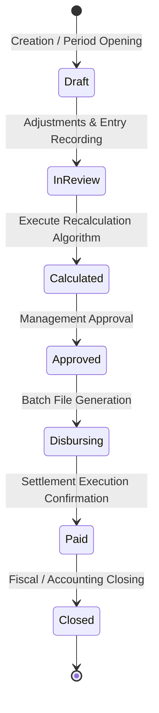
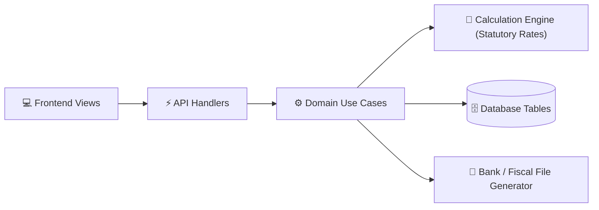
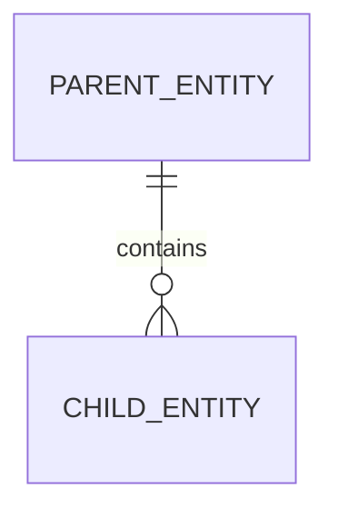

# [Module Name] — Living Documentation

> 📖 Master Module Documentation · Living Domain Document
> 🔄 Last Updated: [YYYY-MM-DD] · Status: [Active / Production / In Progress]
> 👤 Domain Lead: [Product Owner / Tech Lead]
> 📂 Scope: [Brief description of the domain, e.g. Payroll Lifecycle Management, Statutory Deductions, and Bulk Banking Disbursement]
> ⚠️ **MANDATORY QUALITY GATE (Hard Gate 12)**: This document MUST be authored with deep technical rigor and exhaustive engineering detail. Superficial summaries, omitted catalog endpoints, truncated ERD entities, or business rules lacking exact mathematical formulas are strictly prohibited.

---

## 1. Executive Summary & Domain Scope

### 1.1 Business Mission & Actors
- **Business Domain**: [e.g. Human Resources / Payroll / Enterprise Compensation]
- **Target Actors & Boundaries**:
  - **[Actor 1, e.g. HR Operations Specialist]**: [Role and permitted actions]
  - **[Actor 2, e.g. Finance Officer / Treasurer]**: [Role and permitted actions]
  - **[Actor 3, e.g. Employee / Contractor]**: [Role and permitted actions]
  - **[External Actor, e.g. Commercial Banking Portal]**: [Format, frequency and ingestion channel]
- **Core Value Proposition**: [Problem solved, e.g. Exact statutory compensation settlement with 0 regulatory fines and error-free automated bulk disbursement]

### 1.2 Primary Routes & Frontend Navigation
| Route | View / Screen | Target Audience / Role | Status |
|-------|---------------|------------------------|--------|
| `/[module]/[path1]` | [Screen name] | [Authorized Role] | [✅ Production / ⏳ In Progress] |
| `/[module]/[path2]` | [Screen name] | [Authorized Role] | [✅ Production / ⏳ In Progress] |

---

## 2. Capabilities & Sub-Features Matrix

| # | Sub-module / Capability | Functional Description | Status | Spec Link | Test Coverage |
|---|-------------------------|------------------------|--------|-----------|---------------|
| **01** | [Sub-feature 1] | [Capability summary] | [✅ Certified / ⏳ In Progress] | [`specs/[module]/01-...`](../../specs/[module]/01-...) | Unit: XX% · E2E: ✅ |
| **02** | [Sub-feature 2] | [Capability summary] | [✅ Certified / ⏳ In Progress] | [`specs/[module]/02-...`](../../specs/[module]/02-...) | Unit: XX% · E2E: ✅ |

---

## 3. Architecture & Domain Lifecycle

### 3.1 Module State Machine (Lifecycle)

### 3.2 High-Level Component Flow

---

## 4. Consolidated Data Model (Module ERD)

### Key Tables & Data Dictionary
- **`schema.table_1`**: [Purpose, primary key, foreign keys, critical columns and SQL data types]
- **`schema.table_2`**: [Purpose, primary key, foreign keys, critical columns and SQL data types]

---

## 5. Master API Catalog

| Method | Endpoint | Description | Authorized Roles | Request Payload | Response (200/201) |
|--------|----------|-------------|------------------|-----------------|--------------------|
| `GET` | `/api/v1/[module]/...` | [Description] | `[ROLES]` | Query params | JSON DTO |
| `POST` | `/api/v1/[module]/...` | [Description] | `[ROLES]` | Body JSON | `{ "success": true, "data": {...} }` |
| `PATCH` | `/api/v1/[module]/...` | [Description] | `[ROLES]` | Body JSON | `{ "success": true, "updatedId": ... }` |
| `DELETE` | `/api/v1/[module]/...` | [Description] | `[ROLES]` | Query ID | `{ "success": true }` |

---

## 6. Universal Business Rules, Formulas & Compliance

### 6.1 Regulatory & Statutory Rules
- **Rule Set 1 (e.g. Statutory Social Security - TSS Law 87-01)**:
  - Pension Fund (AFP) Employee Deduction: `2.87%` on eligible base salary (statutory ceiling: 20 national minimum wages).
  - Health Insurance (SFS) Employee Deduction: `3.04%` on eligible base salary (statutory ceiling: 10 national minimum wages).
- **Rule Set 2 (e.g. Labor Code Standard Work Hours)**:
  - Monthly work day factor: `23.83` average working days per month.
  - Base hourly rate: `Monthly Base Salary / 23.83 / 8`.
  - Day overtime surcharge: `Base_Hourly_Rate * 1.35` (35% statutory surcharge).
  - Night / Holiday overtime surcharge: `Base_Hourly_Rate * 2.00` (100% statutory surcharge).
- **Rule Set 3 (e.g. Fiscal Agency Withholding - DGII)**:
  - Professional independent contractor withholding: `10%` flat ISR on gross invoiced amount.

### 6.2 Precision & Rounding Rules
- **Base Currency**: DOP (Dominican Pesos) or primary tenant currency.
- **Data Types**: `NUMERIC(12,2)` for currency values, `NUMERIC(6,4)` for tax and deduction percentages.
- **Rounding Algorithm**: Symmetric Half-Up (`Math.round((val + Number.EPSILON) * 100) / 100`) per line item; detail item totals must match the batch master total with `$0.00` tolerance.

### 6.3 Module Error Codes (RFC 7807)
| Error Code | HTTP Status | Root Cause | System Action / User Feedback |
|------------|-------------|------------|-------------------------------|
| `CYCLE_ALREADY_CLOSED` | 400 Bad Request | Mutation attempt on closed accounting cycle | Operation blocked: "This cycle is closed and immutable." |
| `MISSING_BANK_ACCOUNT` | 422 Unprocessable | Employee lacks configured disbursement account | Excluded from batch disbursement file with warning banner. |
| `TENANT_ACCESS_DENIED` | 403 Forbidden | Cross-tenant access attempt | Request rejected immediately; security event logged. |

---

## 7. External Integrations & Banking File Layouts

### 7.1 [Layout 1, e.g. Commercial Bank Fixed-Width TXT (BPD TXT)]
- **File Format**: Fixed-width ASCII flat file.
- **Header Record (H Structure)**:
  `H` + `RNC_TAX_ID (11)` + `SOURCE_ACCOUNT (10)` + `PAYMENT_DATE (YYYYMMDD)` + `TOTAL_AMOUNT (13)` + `BATCH_COUNT (5)`
- **Detail Record (D Structure)**:
  `D` + `ACCOUNT_TYPE (2)` + `ACCOUNT_NUMBER (15)` + `AMOUNT (11)` + `TAX_ID (11)` + `HOLDER_NAME (35)` + `REFERENCE (15)`

### 7.2 [Layout 2, e.g. Multibank Clearing House CSV (ACH SIPA CSV)]
- **Encoding**: UTF-8 with Byte Order Mark (`\uFEFF`) mandatory for native Excel Windows opening without character corruption.
- **Columns**: `Destination_Bank,Account_Type,Account_Number,Holder_Name,Tax_ID,Amount,Reference,Currency`

---

## 8. Audit Trail & Security Policy

- **Immutable Audited Actions**: Cycle opening, adjustment entry mutation, batch recalculation execution, banking file export, and accounting close.
- **Audit Event Schema**: `tenant_id`, `user_id`, `ip_address`, `action`, `resource_id`, `timestamp_utc`, `before_state`, `after_state`.

---

## 9. Change Log & Spec Lineage

| Date | Sub-module / Spec | Milestone Summary | Git Commit | Author / Approver |
|------|-------------------|-------------------|------------|-------------------|
| [YYYY-MM-DD] | `specs/[module]/01-...` | [Functional milestone] | `[hash]` | [Name] |
