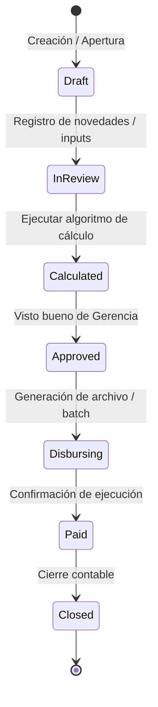
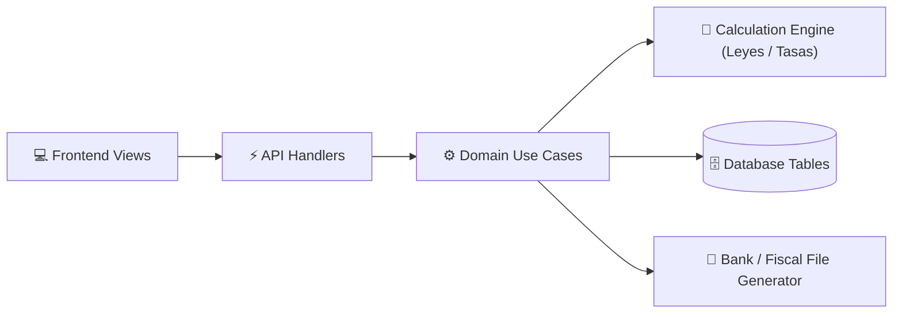

# [Module Name] — Living Documentation

> 📖 Master Module Documentation · Living Domain Document
> 🔄 Last Updated: [YYYY-MM-DD] · Status: [Active / Production / In Progress]
> 👤 Domain Lead: [Product Owner / Tech Lead]
> 📂 Scope: [Brief description of the domain, e.g. Gestión de Nómina, Deducciones de Ley TSS/ISR y Dispersión Bancaria Masiva]
> ⚠️ **MANDATO DE CALIDAD (Hard Gate 12)**: Este documento DEBE ser redactado con máxima profundidad técnica y detalle exhaustivo. Queda estrictamente prohibido el uso de resúmenes superficiales, omitir endpoints en el catálogo, truncar entidades en el ERD o dejar reglas de negocio sin sus fórmulas matemáticas explícitas.

---

## 1. Executive Summary & Domain Scope

### 1.1 Business Mission & Actors
- **Business Domain**: [e.g. Recursos Humanos / Finanzas / Nómina]
- **Target Actors & Boundaries**:
  - **[Actor 1, e.g. Oficial de Gestión Humana]**: [Role and permitted actions]
  - **[Actor 2, e.g. Gerente Financiero / Tesorero]**: [Role and permitted actions]
  - **[Actor 3, e.g. Colaborador / Contratista]**: [Role and permitted actions]
  - **[External Actor, e.g. Portal Bancario Empresarial]**: [Format, frequency and ingestion channel]
- **Core Value Proposition**: [Problem solved, e.g. Liquidación salarial precisa sin multas regulatorias y dispersión bancaria masiva con 0 errores de digitación]

### 1.2 Primary Routes & Frontend Navigation
| Ruta | Vista / Pantalla | Audiencia / Rol | Estado |
|------|------------------|-----------------|--------|
| `/[module]/[path1]` | [Nombre de la pantalla] | [Rol requerido] | [✅ Producción / ⏳ En desarrollo] |
| `/[module]/[path2]` | [Nombre de la pantalla] | [Rol requerido] | [✅ Producción / ⏳ En desarrollo] |

---

## 2. Capabilities & Sub-Features Matrix

| # | Sub-módulo / Capacidad | Descripción Funcional | Estado | Spec Link | Tests / Cobertura |
|---|------------------------|-----------------------|--------|-----------|-------------------|
| **01** | [Sub-feature 1] | [Resumen de la capacidad] | [✅ Certificado / ⏳ En Progreso] | [`specs/[module]/01-...`](../../specs/[module]/01-...) | Unit: XX% · E2E: ✅ |
| **02** | [Sub-feature 2] | [Resumen de la capacidad] | [✅ Certificado / ⏳ En Progreso] | [`specs/[module]/02-...`](../../specs/[module]/02-...) | Unit: XX% · E2E: ✅ |

---

## 3. Architecture & Domain Lifecycle

### 3.1 Module State Machine (Ciclo de Vida)

### 3.2 High-Level Component Flow

---

## 4. Consolidated Data Model (Module ERD)

### Key Tables & Data Dictionary
- **`schema.table_1`**: [Propósito, clave primaria, claves foráneas, columnas críticas y tipo de dato]
- **`schema.table_2`**: [Propósito, clave primaria, claves foráneas, columnas críticas y tipo de dato]

---

## 5. Master API Catalog

| Método | Endpoint | Descripción | Roles Autorizados | Request Payload | Response (200/201) |
|--------|----------|-------------|-------------------|-----------------|--------------------|
| `GET` | `/api/v1/[module]/...` | [Descripción] | `[ROLES]` | Query params | JSON DTO |
| `POST` | `/api/v1/[module]/...` | [Descripción] | `[ROLES]` | Body JSON | `{ success: true, data: {...} }` |
| `PATCH` | `/api/v1/[module]/...` | [Descripción] | `[ROLES]` | Body JSON | `{ success: true, updatedId: ... }` |
| `DELETE` | `/api/v1/[module]/...` | [Descripción] | `[ROLES]` | Query ID | `{ success: true }` |

---

## 6. Universal Business Rules, Formulas & Compliance

### 6.1 Regulatory & Legal Framework
- **Normativa 1 (e.g. TSS Ley 87-01)**:
  - Deducción AFP Empleado: `2.87%` sobre salario cotizable (tope legal: 20 salarios mínimos nacionales).
  - Deducción SFS Empleado: `3.04%` sobre salario cotizable (tope legal: 10 salarios mínimos nacionales).
- **Normativa 2 (e.g. Código de Trabajo Dominicano)**:
  - Factor de jornada mensual ordinaria: `23.83` días laborables promedio al mes.
  - Tarifa horaria base: `Salario Mensual / 23.83 / 8`.
  - Horas extras diurnas: `Tarifa_Hora * 1.35` (recargo legal del 35%).
  - Horas extras nocturnas o feriados: `Tarifa_Hora * 2.00` (recargo legal del 100%).
- **Normativa 3 (e.g. DGII Impuestos)**:
  - Retención personas físicas por servicios profesionales: `10%` de ISR sobre honorarios brutos.

### 6.2 Precision & Rounding Rules
- **Moneda Base**: DOP (Pesos Dominicanos).
- **Tipo de Dato**: `NUMERIC(12,2)` para dinero, `NUMERIC(6,4)` para tasas impositivas.
- **Redondeo**: Simétrico Half-Up (`Math.round((val + Number.EPSILON) * 100) / 100`) a nivel de ítem; la suma de detalles debe cuadrar con discrepancia admisible de `$0.00` contra el total general.

### 6.3 Module Error Codes (RFC 7807)
| Código de Error | HTTP Status | Causa Raíz | Acción del Sistema / UX |
|-----------------|-------------|------------|-------------------------|
| `CYCLE_ALREADY_CLOSED` | 400 Bad Request | Intento de recálculo o mutación en ciclo cerrado | Bloqueo con mensaje: "El período ya está cerrado." |
| `MISSING_BANK_ACCOUNT` | 422 Unprocessable | Colaborador sin cuenta bancaria configurada | Excluido del archivo plano bancario con alerta visual. |
| `TENANT_ACCESS_DENIED` | 403 Forbidden | Intento de acceso a datos de otra empresa | Bloqueo inmediato y registro en auditoría de seguridad. |

---

## 7. External Integrations & Banking File Layouts

### 7.1 [Layout 1, e.g. Banco Popular Dominicano (BPD TXT)]
- **Tipo de Archivo**: Archivo plano posicional de ancho fijo (Fixed-Width ASCII).
- **Estructura de Cabecera (Registro H)**:
  `H` + `RNC (11)` + `CUENTA_ORIGEN (10)` + `FECHA_PAGO (YYYYMMDD)` + `TOTAL_MONTO (13)` + `CANTIDAD (5)`
- **Estructura de Detalle (Registro D)**:
  `D` + `TIPO_CTA (2)` + `NUMERO_CTA (15)` + `MONTO (11)` + `CEDULA_RNC (11)` + `TITULAR (35)` + `REF (15)`

### 7.2 [Layout 2, e.g. ACH SIPA Multibanco (CSV UTF-8 BOM)]
- **Encoding**: UTF-8 con Byte Order Mark (`\uFEFF`) obligatorio para compatibilidad nativa en Excel en Windows sin corrupción de acentos.
- **Columnas**: `Banco_Destino,Tipo_Cuenta,Numero_Cuenta,Nombre_Titular,Cedula_RNC,Monto,Referencia,Moneda`

---

## 8. Audit Trail & Security Policy

- **Acciones Auditadas Inmutables**: Creación de ciclo, modificación de novedades salariales, recálculo en lote, confirmación de dispersión bancaria y exportación de archivos fiscales.
- **Campos de Auditoría**: `tenant_id`, `user_id`, `ip_address`, `action`, `resource_id`, `timestamp_utc`, `before_state`, `after_state`.

---

## 9. Change Log & Spec Lineage

| Fecha | Sub-módulo / Spec | Descripción del Hito | Commit Base | Autor / Aprobador |
|-------|-------------------|----------------------|-------------|-------------------|
| [YYYY-MM-DD] | `specs/[module]/01-...` | [Hito funcional alcanzado] | `[hash]` | [Nombre] |
