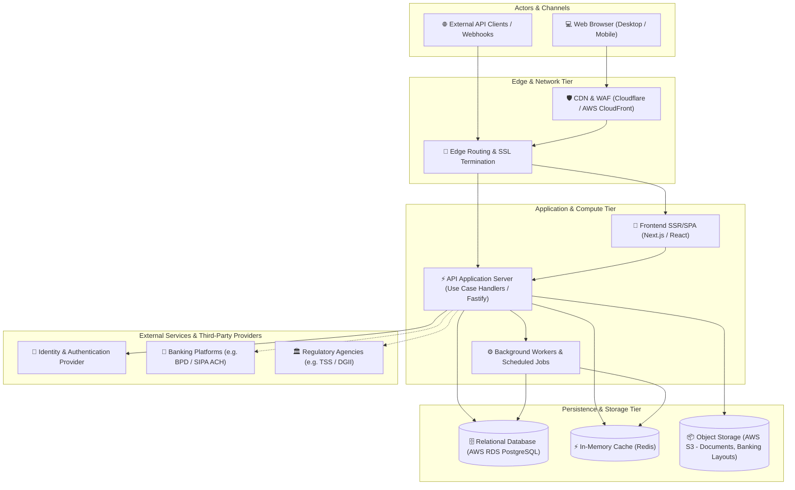
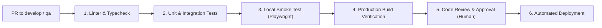

# System Architecture Overview: [System / Project Name]

> 🏛️ Living System Architecture Document · Master Technical Blueprint
> 🔄 Last Updated: [YYYY-MM-DD] · Status: [Draft / Approved / In Production]
> 👤 Technical Authority: [Lead Architect / Engineering Lead]
> 📂 Repository: [Repo Name / URL] · Stack: [Primary Technologies]
> ⚠️ **MANDATORY QUALITY GATE (Hard Gate 12)**: This document MUST be authored with deep technical rigor and exhaustive engineering detail. Superficial summaries, placeholders ('TODO', 'TBD', 'etc.'), or generic diagrams lacking concrete actors and protocols are strictly prohibited. Each layer must explicitly detail its exact technologies and responsibilities, and every security policy must document its concrete implementation mechanism.

---

## 1. Business Context & System Mission

### 1.1 Executive Summary
<!-- Brief description of what the system does, the core business problem it solves, and its strategic goals. -->
- **Business Domain**: [e.g. Human Resources, Enterprise Payroll & Labor Management]
- **Target Audience & Core Actors**:
  - **[Actor 1, e.g. HR Administrator]**: [Role and primary interactions]
  - **[Actor 2, e.g. Finance Officer]**: [Role and primary interactions]
  - **[Actor 3, e.g. Employee / Self-Service]**: [Role and primary interactions]
  - **[System Actor, e.g. Banking Portal / Payment Gateway]**: [External integration interactions]
- **Core Value Proposition**: [Key business metrics impacted, e.g. Automated statutory payroll settlement, 0 regulatory fines with TSS/DGII]

### 1.2 System Scope & Boundaries
- **In Scope**:
  - [Core capability 1]
  - [Core capability 2]
- **Out of Scope (Delegated to external systems)**:
  - [External capability 1, e.g. Centralized ERP General Ledger accounting]
  - [External capability 2, e.g. Bilateral direct clearing house API processing]

---

## 2. Architecture Landscape & C4 Container Model

### 2.1 High-Level Architecture Diagram



### 2.2 Layer Responsibilities

| Layer | Technologies | Technical Responsibilities |
|-------|--------------|----------------------------|
| **Presentation (UI/UX)** | Next.js 15, React, Tailwind CSS | Page rendering, client state management, input validation, and accessible visual feedback. |
| **API & Domain (Backend)** | TypeScript, Clean Architecture Use Cases | Use case orchestration, business rules enforcement, ACID transactions, and response serialization. |
| **Background / Jobs** | Node.js Cron / Worker Queues | Asynchronous heavy tasks (batch bank file layout generation, bulk metric recalculations). |
| **Persistence** | PostgreSQL 16 (AWS RDS) | Referential integrity, tenant-partitioned secure storage, audit trails, and materialized views. |
| **Binary Object Storage** | AWS S3 / Compatible | Generated flat banking files, fiscal PDF receipts, and signed electronic agreements. |

---

## 3. Infrastructure, Environments & CI/CD Topology

### 3.1 Environment Matrix

| Environment | Purpose | Git Branch | URL / Domain | Database | Deployment Trigger |
|-------------|---------|------------|--------------|----------|-------------------|
| **Local** | Active development & TDD | Feature branch (`feat/*`, `fix/*`) | `http://localhost:3000` | RDS Dev or Local PostgreSQL | `npm run dev` |
| **Development (DEV)** | Continuous feature integration | `develop` | `https://dev-app.company.com` | RDS Dev (Shared Tenant) | Automatic merge of PR into `develop` |
| **QA / Staging** | Sprint cut certification & E2E tests | `qa` | `https://qa-app.company.com` | RDS QA (Prod parity) | Merge of `release/corte-*` into `qa` |
| **Production (PROD)** | Live customer-facing system | `main` | `https://app.company.com` | RDS Multi-AZ Production | Merge of `release/prod-*` + Human Approval |

### 3.2 CI/CD Pipeline Workflow



---

## 4. Security, Identity & Multi-Tenancy Architecture

### 4.1 Multi-Tenant Data Isolation Strategy
- **Strict Logical Isolation**: Every business entity is bound to a `tenant_id` (UUID).
- **Enforcement Mechanisms**:
  1. **Session Middleware**: Injects and validates `tenant_id` extracted from the authenticated user's cryptographic session token.
  2. **Mandatory Query Filtering**: Every SQL query or query builder includes `WHERE tenant_id = :tenantId`.
  3. **Composite Unique Constraints**: Business codes are scoped by tenant: `UNIQUE (tenant_id, code)`.
  4. **Row Level Security (RLS)**: Enforced at the PostgreSQL engine level as a second defense line against accidental cross-tenant data leakage.

### 4.2 Authentication & Authorization (RBAC)
- **Token Strategy**: JWT with Refresh Token rotation and `HttpOnly; Secure; SameSite=Strict` cookies.
- **Role-Based Access Control (RBAC) Matrix**:
  - `SUPER_ADMIN`: Global platform and tenant administration.
  - `TENANT_ADMIN`: Company setup, labor policy management, and user provisioning.
  - `HR_MANAGER`: Employee lifecycle, adjustments, and contracts management.
  - `FINANCE_OFFICER`: Payroll recalculation, accounting approval, and banking distribution.
  - `EMPLOYEE`: Strict self-service read-only access to own payment receipts.

### 4.3 Secret Management & Compliance
- **Zero Plaintext Rule**: Credentials, private keys, or PATs are strictly banned from source code. Injected via secure environment variables (AWS Secrets Manager / Vault / CI Secrets).
- **Cryptographic Encryption**:
  - In Transit: TLS 1.3 mandatory across all public and internal endpoints.
  - At Rest: Transparent Database Encryption (TDE / AES-256) on RDS volumes and S3 storage buckets.

---

## 5. Cross-Cutting Concerns & Observability

### 5.1 Logging & Structured Auditing
- **Log Schema**: Single-line structured JSON with ISO 8601 UTC timestamp, `correlation_id`, `tenant_id`, log level (`INFO`, `WARN`, `ERROR`), endpoint path, and execution latency.
- **Statutory Audit Trail**: Critical business events (payroll cycle approval, banking disbursement confirmation, compensation mutations) generate immutable records in `audit_events` containing user, IP, action, timestamp, and pre/post-mutation data snapshots.

### 5.2 Error Handling & Resilience Pattern
- **Standardized Error Envelope**: RFC 7807 (Problem Details) format:
  ```json
  {
    "type": "https://api.company.com/errors/payroll-cycle-closed",
    "title": "Payroll Cycle State Conflict",
    "status": 409,
    "detail": "The payroll cycle is closed and disbursed. Mutations and recalculations are blocked.",
    "instance": "/api/v1/payroll/cycles/uuid/calculate"
  }
  ```
- **Idempotency**: Critical financial mutation endpoints (`/calculate`, `/confirm`, `/payments`) require an `Idempotency-Key` HTTP header to prevent duplicate execution during network retries.

---

## 6. Architecture Decision Records (ADR Summary)

| ID | Date | Technical Decision | Context & Rationale | Status |
|----|------|--------------------|---------------------|--------|
| **ADR-001** | [YYYY-MM-DD] | Clean Architecture + Next.js App Router | Decouples pure domain business logic from web infrastructure, enabling rapid unit testing of statutory algorithms without running a web server. | Accepted |
| **ADR-002** | [YYYY-MM-DD] | AWS RDS PostgreSQL with `huro` schema | Proven ACID engine with cryptographic extension support and strict `NUMERIC(12,2)` precision preventing financial decimal rounding discrepancies. | Accepted |
| **ADR-003** | [YYYY-MM-DD] | Batch banking flat-file layouts (BPD TXT / ACH CSV) | Enables immediate bulk payroll disbursement compatible with legacy and modern banking portals without waiting for private bilateral bank APIs. | Accepted |
