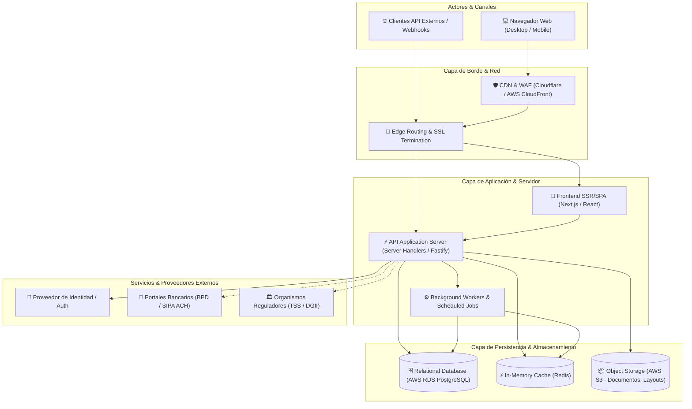
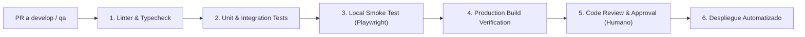

# System Architecture Overview: [System / Project Name]

> 🏛️ Living System Architecture Document · Master Technical Blueprint
> 🔄 Last Updated: [YYYY-MM-DD] · Status: [Draft / Approved / In Production]
> 👤 Technical Authority: [Lead Architect / Engineering Lead]
> 📂 Repository: [Repo Name / URL] · Stack: [Primary Technologies]
> ⚠️ **MANDATO DE CALIDAD (Hard Gate 12)**: Este documento DEBE ser redactado con máxima profundidad técnica y detalle exhaustivo. Queda estrictamente prohibido el uso de resúmenes superficiales, placeholders ('TODO', 'TBD', 'etc.'), o diagramas genéricos sin actores ni protocolos. Cada capa debe especificar sus tecnologías y responsabilidades exactas, y cada política de seguridad su mecanismo de implementación.

---

## 1. Business Context & System Mission

### 1.1 Executive Summary
<!-- Brief description of what the system does, the core business problem it solves, and its strategic goals. -->
- **Business Domain**: [e.g. Recursos Humanos, Nómina y Gestión Laboral]
- **Target Audience & Core Actors**:
  - **[Actor 1, e.g. Administrador de RRHH]**: [Role and primary interactions]
  - **[Actor 2, e.g. Gerente Financiero]**: [Role and primary interactions]
  - **[Actor 3, e.g. Colaborador / Autoservicio]**: [Role and primary interactions]
  - **[System Actor, e.g. Portal Bancario / Pasarela]**: [External integration interactions]
- **Core Value Proposition**: [Key business metrics impacted, e.g. Automatización de liquidación salarial, cumplimiento legal dominicano con 0 multas TSS/DGII]

### 1.2 System Scope & Boundaries
- **In Scope**:
  - [Core capability 1]
  - [Core capability 2]
- **Out of Scope (Delegated to external systems)**:
  - [External capability 1, e.g. Procesamiento contable ERP centralizado]
  - [External capability 2, e.g. Envío masivo de nómina vía API bilateral bancaria]

---

## 2. Architecture Landscape & C4 Container Model

### 2.1 High-Level Architecture Diagram



### 2.2 Layer Responsibilities

| Capa | Tecnologías | Responsabilidad Técnica |
|------|-------------|-------------------------|
| **Presentación (UI/UX)** | Next.js 15, React, Tailwind CSS | Renderizado de páginas, gestión de estado cliente, validación de inputs y feedback visual accesible. |
| **API & Negocio (Backend)** | TypeScript, Clean Architecture Use Cases | Orquestación de casos de uso, cumplimiento de reglas de negocio, transacciones ACID y serialización de respuestas. |
| **Background / Jobs** | Node.js Cron / Worker Queues | Tareas asíncronas pesadas (generación de layouts bancarios masivos, sincronización de métricas). |
| **Persistencia** | PostgreSQL 16 (AWS RDS) | Integridad referencial, almacenamiento seguro particionado por tenant, auditoría y vistas materializadas. |
| **Almacenamiento Binario** | AWS S3 / Compatible | Archivos planos bancarios generados, comprobantes fiscales en PDF y contratos digitalizados. |

---

## 3. Infrastructure, Environments & CI/CD Topology

### 3.1 Environment Matrix

| Entorno | Propósito | Rama Git | URL / Dominio | Base de Datos | Trigger Despliegue |
|---------|-----------|----------|---------------|---------------|-------------------|
| **Local** | Desarrollo activo & TDD | Rama de trabajo (`feat/*`, `fix/*`) | `http://localhost:3000` | RDS Dev o PostgreSQL local | `npm run dev` |
| **Development (DEV)** | Integración continua de features | `develop` | `https://dev-app.empresa.com` | RDS Dev (Tenant compartido) | Merge automático de PR a `develop` |
| **QA / Staging** | Certificación de cortes y pruebas E2E | `qa` | `https://qa-app.empresa.com` | RDS QA (Paridad con Prod) | Merge de `release/corte-*` a `qa` |
| **Production (PROD)** | Entorno productivo clientes | `main` | `https://app.empresa.com` | RDS Multi-AZ Production | Merge de `release/prod-*` + Aprobación Humana |

### 3.2 CI/CD Pipeline Workflow



---

## 4. Security, Identity & Multi-Tenancy Architecture

### 4.1 Multi-Tenant Data Isolation Strategy
- **Aislamiento Lógico Estricto**: Toda entidad pertenece a un `tenant_id` (UUID).
- **Mecanismos de Protección**:
  1. **Middleware de Sesión**: Inyecta y valida el `tenant_id` extraído del token criptográfico de sesión del usuario autenticado.
  2. **Filtro Mandatorio**: Toda consulta SQL o query builder incluye `WHERE tenant_id = :tenantId`.
  3. **Índices de Unicidad Compuestos**: Los códigos unívocos se componen con el tenant: `UNIQUE (tenant_id, code)`.
  4. **Row Level Security (RLS)**: Activado como segunda barrera a nivel de motor de base de datos para prevenir fugas accidentales por queries mal formadas.

### 4.2 Authentication & Authorization (RBAC)
- **Token Strategy**: JWT con rotación de Refresh Tokens y cookies `HttpOnly; Secure; SameSite=Strict`.
- **Matriz de Roles (RBAC)**:
  - `SUPER_ADMIN`: Gestión global de la plataforma e inquilinos.
  - `TENANT_ADMIN`: Configuración de empresa, políticas laborales y usuarios.
  - `HR_MANAGER`: Gestión de empleados, novedades y contratos.
  - `FINANCE_OFFICER`: Recálculo salarial, aprobación contable y dispersión bancaria.
  - `EMPLOYEE`: Acceso exclusivo de lectura a sus propios comprobantes de pago.

### 4.3 Gestión de Secretos y Cumplimiento
- **Secretos**: Prohibido el almacenamiento de credenciales, llaves privadas o PATs en el código fuente. Se inyectan mediante variables de entorno seguras (AWS Secrets Manager / Vault / CI Secrets).
- **Encriptación**:
  - En Tránsito: TLS 1.3 mandatorio en todos los endpoints públicos e internos.
  - En Reposo: Encriptación transparente de base de datos (TDE / AES-256) en AWS RDS y buckets S3.

---

## 5. Cross-Cutting Concerns & Observability

### 5.1 Logging & Structured Auditing
- **Formato de Logs**: JSON estructurado con timestamp ISO 8601, `correlation_id`, `tenant_id`, nivel (`INFO`, `WARN`, `ERROR`), endpoint y latencia.
- **Audit Trail Fiscal**: Acciones críticas (aprobación de nómina, confirmación de dispersión bancaria, mutación de salarios) generan un registro inmutable en `audit_events` detallando usuario, IP, acción, timestamp y snapshot previo/posterior del dato.

### 5.2 Error Handling & Resilience Pattern
- **Estandarización de Errores**: Formato RFC 7807 (Problem Details):
  ```json
  {
    "type": "https://api.empresa.com/errors/payroll-cycle-closed",
    "title": "Conflicto de Estado de Nómina",
    "status": 409,
    "detail": "El ciclo se encuentra cerrado y dispersado. No admite recálculo ni mutaciones.",
    "instance": "/api/v1/payroll/cycles/uuid/calculate"
  }
  ```
- **Idempotencia**: Endpoints de mutación financiera crítica (`/calculate`, `/confirm`, `/payments`) requieren cabecera `Idempotency-Key` para evitar cargos dobles por desconexión de red.

---

## 6. Architecture Decision Records (ADR Summary)

| ID | Fecha | Decisión Técnica | Contexto y Justificación | Estado |
|----|-------|------------------|--------------------------|--------|
| **ADR-001** | [YYYY-MM-DD] | Clean Architecture + Next.js App Router | Desacopla la lógica de negocio pura de la infraestructura web, facilitando pruebas unitarias de algoritmos tributarios sin levantar servidor. | Aceptado |
| **ADR-002** | [YYYY-MM-DD] | AWS RDS PostgreSQL con esquema particionado `huro` | Motor ACID probado con soporte de extensiones criptográficas y precisión `NUMERIC(12,2)` para cálculo financiero sin pérdida decimal. | Aceptado |
| **ADR-003** | [YYYY-MM-DD] | Layouts bancarios batch en archivo plano (BPD TXT / ACH CSV) | Permite dispersión masiva inmediata compatible con las plataformas actuales de los bancos de RD sin depender de APIs bancarias privadas no expuestas. | Aceptado |
